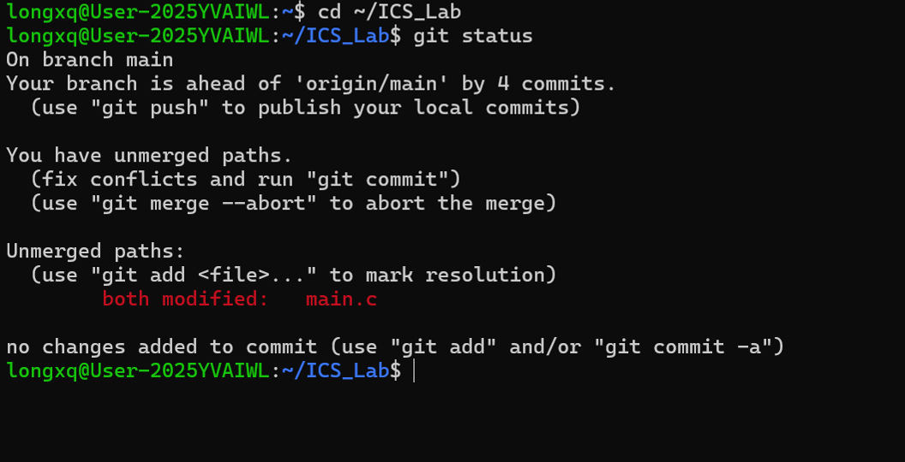
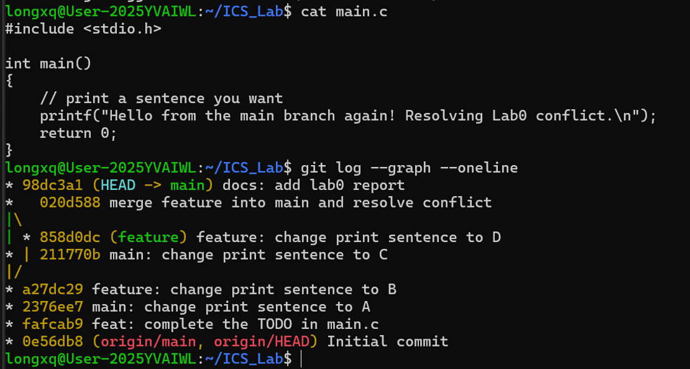

Lab0: GitLab 实验报告

姓名：龙雪琪　　学号：25303020009　　日期：2026-09-27

仓库地址：https://github.com/lxq-fd-id/ICS_Lab

任务一 文档问题回答

1. 你之前有过多人协同开发的经历吗？如果有，你们是使用什么方式分工协作的？

答：我之前没有正式的多人协同开发经历。以前自己编写小程序时，习惯采用"每修改一版便复制整个文件夹"的方式备份，导致目录中出现多个难以区分的副本，时间一长便无法判断哪一份才是最新版本。通过本次实验，我第一次完整经历了"两个分支分别修改同一文件 → 合并时产生冲突 → 手动解决冲突"的整个过程，从而更深入地理解了版本控制对多人协作的意义：它不会替使用者消除分歧，但能够将分歧明确地暴露出来，并提供一个安全、可追踪的处理流程，这比两人各自修改后相互覆盖的方式可靠得多。

2. 思考一下，Git 为什么要设计"暂存-提交"两个步骤？

答：Git 将文件状态划分为工作区、暂存区和仓库三层，暂存区是工作区与仓库之间的缓冲区。这一设计解决的核心问题，是把"正在修改什么"与"决定记录什么"分离开来，具体体现在以下几个方面：

（1）精确挑选改动，形成语义完整的提交。实际开发中往往同时存在多种性质的修改，例如一处修复缺陷、一处新增功能。借助 git add 可以将相关改动归入同一次提交，使每次提交主题单一、便于回溯；若没有暂存区，提交将难以做到这种粒度控制。

（2）提交前可以进行核查。暂存完成后、提交之前，可以使用 git status 和 git diff --cached 检查即将入库的内容，避免将临时文件或无关改动误提交。

（3）降低分支切换与半成品管理的成本。暂存区与工作区分离后，可以只暂存一部分改动、丢弃另一部分，或在未整理完毕的情况下安全切换分支，不必担心半成品状态丢失。

（4）符合"提交即历史节点"的语义。提交一旦写入仓库便成为不可轻易改变的记录，而暂存是提交前的选择与斟酌过程，将"选择"与"定格"分开，有助于保持提交历史的清晰与可信。

3. git branch 和 git branch -a 的区别是什么？

答：git branch 只列出本地分支；git branch -a（即 --all）除此之外还会列出远程跟踪分支，其形式为 remotes/origin/分支名。远程跟踪分支记录的是本地保存的、远程仓库分支在最近一次 clone 或 fetch 时的状态。在本次实验中，我执行 git branch -a 时看到本地分支 main 与 feature，而 remotes/origin/main 仍停留在最早的 Initial commit，这直观地反映出本地已领先远程若干提交且尚未推送；若只使用 git branch，则无法获知远程分支与本地分支之间的差异。

任务二 完成 main.c 的 TODO 并提交

模板仓库中的 main.c 含有一个 TODO 注释，要求打印一句自己想说的话。我将其中的打印内容改为自定义句子，并补充了 return 0 语句：

#include <stdio.h>

int main()
{
    // print a sentence you want
    printf("Hello, world! This is lobster's Lab0 submission.\n");
    return 0;
}

随后使用 make 编译运行验证（输出正常，无编译警告），使用 make clean 清理编译产物，再执行 git add main.c 与 git commit，提交信息为 "feat: complete the TODO in main.c"。

任务三 阅读文章并谈谈对 Git 的理解

1. 《Commit Message 规范》（阮一峰）内容概括

文章介绍了目前较为流行的 Angular 规范，提交信息格式为 type(scope): subject，其中 type 常见取值包括 feat（新功能）、fix（修复缺陷）、docs（文档）、refactor（重构）、perf（性能）、test（测试）、chore（杂项）等。规范化提交信息的主要好处有三点：一是提供更丰富的历史信息，通过 git log 可以快速了解每次提交的目的；二是便于按类型过滤查询提交记录；三是可以直接从提交记录生成 Change log，用于发布时说明版本差异。个人理解是，提交信息是对"本次改动目的"的记录，规范书写相当于为未来的自己和协作者保留索引。

2. 《Git Flow 分支控制》内容概括

文章介绍了 Gitflow 分支管理模型：master 与 develop 为两条永久分支，前者始终与线上发布版本保持一致，后者用于日常开发集成；feature、release、hotfix 为三类临时分支，分别用于新功能开发、发布准备与线上紧急修复，均在使用完毕后合并回相应分支并删除。该模型遵循"从哪里来，回到哪里去"的原则，使各分支职责明确，从而降低多人协作中的冲突概率与发布风险。结合本次实验对 feature 分支的使用，可以体会到按功能划分分支、保持分支隔离对控制合并复杂度的价值。

3. 对"为什么要学习 Git"的理解

Git 是当前软件行业使用最广泛的版本控制工具。对个人而言，它记录了每一次修改并支持随时回溯，替代了复制文件夹式的备份方式，使代码历史有序且可审计；对团队而言，它是多人协作的基础，分支机制允许并行开发，合并与冲突解决机制使分歧能够被显式发现和处理；对本课程而言，后续每个实验都需要通过 Git 交付，掌握 Git 是完成课程任务的前提；对未来的工程实践而言，Git 是开源协作与团队开发的基础技能。

任务四 分支管理与合并冲突

按照文档要求，我在 main 分支上修改 printf 打印内容为句子 A 并提交，随后执行 git switch -c feature 创建并切换到 feature 分支，将同一行打印内容改为句子 B 并提交。第一次执行 git merge feature 时为 Fast-forward 合并，未产生冲突，原因是 feature 分支仅领先于 main 分支，两个分支尚未分叉。

按照文档提示，我继续提交使两个分支真正分叉：在 main 分支上提交句子 C，在 feature 分支上提交句子 D，再次执行 git merge feature 时出现冲突：

Auto-merging main.c
CONFLICT (content): Merge conflict in main.c
Automatic merge failed; fix conflicts and then commit the result.

git status 显示 Unmerged paths，即 both modified: main.c。打开 main.c 可见冲突标记：

<<<<<<< HEAD
    printf("Hello from the main branch again! Resolving Lab0 conflict.\n");
=======
    printf("Hello from the feature branch again! Feature keeps its sentence.\n");
>>>>>>> feature

其中 <<<<<<< HEAD 与 ======= 之间为当前分支（HEAD）的版本，======= 与 >>>>>>> feature 之间为 feature 分支的版本。我手动删除三行冲突标记，保留其中一句，然后执行 git add main.c 与 git commit，提交信息为 "merge feature into main and resolve conflict"，合并完成。最终提交历史中可见一个由 main 与 feature 汇合而成的合并节点。

（截图 1：遇到冲突时的 git status 输出）

（截图 2：解决冲突后干净的 main.c 与提交历史）

遇到的问题与解决

1. 安装编译工具时执行 apt update 报错 Could not resolve 'mirrors.fudan.edu.cn'，排查后确认是软件源中配置的复旦镜像域名在当前网络环境下无法解析，将软件源替换为官方源 archive.ubuntu.com 后安装成功。

2. 第一次合并未出现冲突，原因是分支尚未分叉而执行了快进合并。按照文档提示继续在两侧提交制造分叉后，成功触发并解决了冲突，这一过程也加深了对"冲突只发生在分支分叉之后"的理解。

3. 最初不了解如何从 Windows 访问 WSL 中的文件，后来通过 \\wsl$\Ubuntu\home\longxq\ICS_Lab 路径或直接在 VSCode 中打开 WSL 目录解决。

总结

本次实验完整实践了环境配置、SSH 认证、基于模板创建仓库、克隆、修改提交、分支管理、合并冲突解决以及报告提交的完整流程，重点理解了暂存区在提交过程中的作用，并通过实际操作掌握了冲突的产生条件与解决方法。建议实验文档补充 apt 软件源切换的说明，并给出 git switch 与 git checkout、git restore 与 git checkout 等新旧命令的对应关系，以帮助习惯旧命令的同学平滑过渡。
